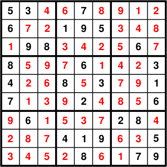

A Sudoku Problem formulated as an LP
====================================

Problem Description
-------------------

A `sudoku problem <http://en.wikipedia.org/wiki/Sudoku>`_ is a problem where there are is an incomplete 9x9 table of numbers which must be filled according
to several rules:

+ Within any of the 9 individual 3x3 boxes, each of the numbers 1 to 9 must be
  found
+ Within any column of the 9x9 grid, each of the numbers 1 to 9 must be found
+ Within any row of the 9x9 grid, each of the numbers 1 to 9 must be found

On this page we will formulate the below problem from wikipedia to model using PuLP. Once created, our code will need little modification to solve any sudoku problem at all.

Formulation
-----------

Identify the Decision Variables
~~~~~~~~~~~~~~~~~~~~~~~~~~~~~~~

In order to formulate this problem as a linear program, we cannot simply create
a variable for each of the 81 squares between 1 and 9 representing the value in
that square. This is because in linear programming there is no "not equal to"
operator and so we cannot use the necessary constraints of no squares within a
box/row/column being equal in value to each other. Whilst we can ensure the sum
of all the values in a box/row/column equal 45, this will still result in many
solutions satisfying the 45 constraint but still with 2 of the same number in
the same box/row/column.

Instead, we must create 729 individual binary (0-1) problem variables. These
represent 9 problem variables per square for each of 81 squares, where the 9
variables each correspond to the number that might be in that square. The
binary nature of the variable says whether the existence of that number in that
square is true or false. Therefore, there can clearly be only 1 of the 9
variables for each square as true (1) and the other 8 must be false (0) since
only one number can be placed into any square. This will become more clear.

Formulate the Objective Function
~~~~~~~~~~~~~~~~~~~~~~~~~~~~~~~~~~~

Interestingly, with sudoku there is no solution that is better than another
solution, since a solution by definition, must satisfy all the constraints.
Therefore, we are not really trying to minimise or maximise anything, we are
just trying to find the values on our variables that satisfy the constraints.
Therefore, whilst either :attr:`~pulp.LpMinimize` or :attr:`~pulp.LpMaximize` must be entered, it is not
important which. Similarly, the objective function can be anything, so in this
example it is simply zero.
That is we are trying to minimize zero, subject to our constraints (meeting the constraints being the important part) 

Formulate the Constraints
~~~~~~~~~~~~~~~~~~~~~~~~~

These are simply the known constraints of a sudoku problem plus the constraints
on our own created variables we have used to express the features of the
problem: 

+ The values in the squares in any row must be each of 1 to 9 
+ The values in the squares in any column must be each of 1 to 9 
+ The values in the squares in any box must be each of 1 to 9
  (a box is one of the 9 non-overlapping 3x3 grids within the overall 9x9 grid) 
+ There must be only one number within any square (seems logically obvious, but
  it is important to our formulation to ensure because of our variable choices) 
+ The starting sudoku numbers must be in those same places in the final
  solution (this is a constraint since these numbers are not changeable in the
  actual problem, whereas we can control any other numbers. If none or very few
  starting numbers were present, the sudoku problem would have a very large
  number of feasible solutions, instead of just one) 

Solution
--------

The introductory commenting and import statement are entered

.. literalinclude:: ../../../examples/Sudoku1.py
    :lines: 1-8

In the unique case of the sudoku problem, the row names, column names and variable option values are all the exact same list of numbers (as strings) from "1" to "9".

.. literalinclude:: ../../../examples/Sudoku1.py
    :lines: 10-16

A list called `Boxes` is created with 9 elements, each being another list. These 9 lists correspond to each of the 9 boxes, and each of the lists contains tuples as the elements with the row and column indices for each square in that box. Explicitly entering the values in a similar way to the following would have had the same effect (but would have been a waste of time): 

.. literalinclude:: ../../../examples/Sudoku1.py
    :lines: 18-22

Therefore, Boxes[0] will return a list of tuples containing the locations of each of the 9 squares in the first box.

The prob variable is created to contain the problem data. LpMinimize has the same effect as LpMaximise in this case. 

.. literalinclude:: ../../../examples/Sudoku1.py
    :lines: 24-25

The 729 problem variables are created since the `(Vals,Rows,Cols)` creates a variable for each combination of value, row and column. An example variable would be: Choice_4_2_9, and it is defined to be a binary variable (able to take only the integers 1 or 0. If Choice_4_2_9 was 1, it would mean the number 4 was present in the square situated in row 2, column 9. (If it was 0, it would mean there was not a 4 there)

.. literalinclude:: ../../../examples/Sudoku1.py
    :lines: 27-28

As explained above, the objective function (what we try to change using the problem variables) is simply zero (constant) since we are only concerned with any variable combination that can satisfy the constraints.

.. literalinclude:: ../../../examples/Sudoku1.py
    :lines: 30-31

Since there are 9 variables for each square, it is important to specify that only exactly one of them can take the value of "1" (and the rest are "0"). Therefore, the below code reads: for each of the 81 squares, the sum of all the 9 variables (each representing a value that could be there) relating to that particular square must equal 1. 

.. literalinclude:: ../../../examples/Sudoku1.py
    :lines: 33-36

These constraints ensure that each number (value) can only occur once in each row, column and box.

.. literalinclude:: ../../../examples/Sudoku1.py
    :lines: 38-47

The starting numbers are entered as constraints i.e a "5" in row "1" column "1" is true.

.. literalinclude:: ../../../examples/Sudoku1.py
    :lines: 49-78

The problem is written to an LP file, solved using CPLEX (due to CPLEX's simple output) and the solution status is printed to the screen 

.. literalinclude:: ../../../examples/Sudoku1.py
    :lines: 80-87

Instead of printing out all 729 of the binary problem variables and their respective values, it is most meaningful to draw the solution in a text file. The code also puts lines inbetween every third row and column to make the solution easier to read. The sudokuout.txt file is created in the same folder as the .py file.

.. literalinclude:: ../../../examples/Sudoku1.py
    :lines: 92-108

A note of the location of the solution is printed to the solution

.. literalinclude:: ../../../examples/Sudoku1.py
    :lines: 110-111

The full file above is given provided `Sudoku1.py <https://projects.coin-or.org/PuLP/browser/trunk/examples/Sudoku1.py?format=txt>`_

The final solution should be the following: 

Extra for Experts
-----------------

In the above formulation we did not consider the fact that there may be multiple solutions if the sudoku problem is not well defined.

We can make our code return all the solutions by editing our code as shown after the `prob.writeLP` line. Essentially we are just looping over the solve statement, and each time after a successful solve, adding a constraint that the same solution cannot be used again. When there are no more solutions, our program ends.

.. literalinclude:: ../../../examples/Sudoku2.py
    :lines: 82-115

The full file using this is available `Sudoku2.py <https://projects.coin-or.org/PuLP/browser/trunk/examples/Sudoku2.py?format=txt>`_. When using this code for sudoku problems with a large number of solutions, it could take a very long time to solve them all. To create sudoku problems with multiple solutions from unique solution sudoku problem, you can simply delete a starting number constraint. You may find that deleting several constraints will still lead to a single optimal solution but the removal of one particular constraint leads to a sudden dramatic increase in the number of solutions. 
