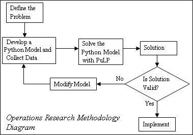

The Optimisation Process
========================

Solving an optimisation problem is not a linear process, but the process can be 
broken down into five general steps:

+ Getting the problem description
+ Formulating the mathematical program
+ Solving the mathematical program
+ Performing some post-optimal analysis
+ Presenting the solution and analysis 

However, there are often "feedback loops" within this process. For example, 
after formulating and solving an optimisation problem, you will often want to 
consider the validity of your solution (often consulting with the person who 
provided the problem description). If your solution is invalid you may need to 
alter or update your formulation to incorporate your new understanding of the 
actual problem. This process is shown in the Operations Research Methodology 
Diagram. 

 
The modeling process starts with a well-defined model description, then uses 
mathematics to formulate a mathematical program. Next, the modeler enters the 
mathematical program into some solver software, e.g., Excel and solves the 
model. Finally, the solution is translated into a decision in terms of the 
original model description.

Using Python gives you a "shortcut" through the modeling process. By formulating 
the mathematical program in Python you have already put it into a form that 
can be used easily by PuLP the modeller to call many solvers, e.g. CPLEX, COIN, 
gurobi so you don't need to enter the mathematical program into the solver 
software. However, you usually don't put any "hard" numbers into your 
formulation, instead you "populate" your model using data files, so there is 
some work involved in creating the appropriate data file. The advantage of using 
data files is that the same model may used many times with different data sets.

The Modeling Process
--------------------

The modeling process is a "neat and tidy" simplification of the optimisation 
process. Let's consider the five steps of the optimisation process in more 
detail:

Getting the Problem Description
~~~~~~~~~~~~~~~~~~~~~~~~~~~~~~~

The aim of this step is to come up with a formal, rigourous model description. 
Usually you start an optimisation project with an abstract description of a 
problem and some data. Often you need to spend some time talking with the 
person providing the problem (usually known as the client). By talking with the 
client and considering the data available you can come up with the more 
rigourous model description you are used to. Sometimes not all the data will be 
relevant or you will need to ask the client if they can provide some other 
data. Sometimes the limitations of the available data may change your model 
description and subsequent formulation significantly.

Formulating the mathematical program
~~~~~~~~~~~~~~~~~~~~~~~~~~~~~~~~~~~~~~
In this step we identify the key quantifiable decisions, restrictions and goals 
from the problem description, and capture their interdependencies in a 
mathematical model. We can break the formulation process into 4 key steps:

* Identify the Decision Variables paying particular attention to units (for example: we need to decide how many hours per week each process will run for).
* Formulate the Objective Function using the decision variables, we can construct a minimise or maximise objective function. The objective function typically reflects the total cost, or total profit, for a given value of the decision variables.
* Formulate the Constraints, either logical (for example, we cannot work for a negative number of hours), or explicit to the problem description. Again, the constraints are expressed in terms of the decision variables.
* Identify the Data needed for the objective function and constraints. To solve your mathematical program you will need to have some "hard numbers" as variable bounds and/or variable coefficients in your objective function and/or constraints. 

Solving the mathematical program
~~~~~~~~~~~~~~~~~~~~~~~~~~~~~~~~~~
For relatively simple or well understood problems the mathematical model can 
often be solved to optimality (i.e., the best possible solution is identified). 
This is done using algorithms such as the Revised Simplex Method 
or Interior Point Methods. However, many 
industrial problems would take too long to solve to optimality using these 
techniques, and so are solved using heuristic methods which do not guarantee optimality.

Performing some post-optimal analysis
~~~~~~~~~~~~~~~~~~~~~~~~~~~~~~~~~~~~~
Often there is uncertainty in the problem description (either with the accuracy 
of the data provided, or with the value(s) of data in the future). In this 
situation the robustness of our solution can be examined by performing 
post-optimal analysis. This involves identifying how the optimal solution would 
change under various changes to the formulation (for example, what would be the 
effect of a given cost increasing, or a particular machine failing?). This sort 
of analysis can also be useful for making tactical or strategic decisions (for 
example, if we invested in opening another factory, what effect would this have on our revenue?).

Another important consideration in this step (and the next) is the validation of 
the mathematical program's solution. You should carefully consider what the 
solution's variable values mean in terms of the original problem description. 
Make sure they make sense to you and, more importantly, your client (which is 
why the next step, presenting the solution and analysis is important).

Presenting the solution and analysis
~~~~~~~~~~~~~~~~~~~~~~~~~~~~~~~~~~~~
A crucial step in the optimisation process is the presentation of the solution 
and any post-optimal analysis. The translation from a mathematical program's 
solution back into a concise and comprehensible summary is as important as the 
translation from the problem description into the mathematical program. Key 
observations and decisions generated via optimisation must be presented in an 
easily understandable way for the client or project stakeholders.

Your presentation is a crucial first step in the implementation of the decisions 
generated by your mathematical program. If the decisions and their consequences 
(often determined by the mathematical program constraints) are not presented 
clearly and intelligently your optimal decision will never be used.

This step is also your chance to suggest other work in the future. This could include:

* Periodic monitoring of the validity of your mathematical program;
* Further analysis of your solution, looking for other benefits for your client;
* Identification of future optimisation opportunities. 
